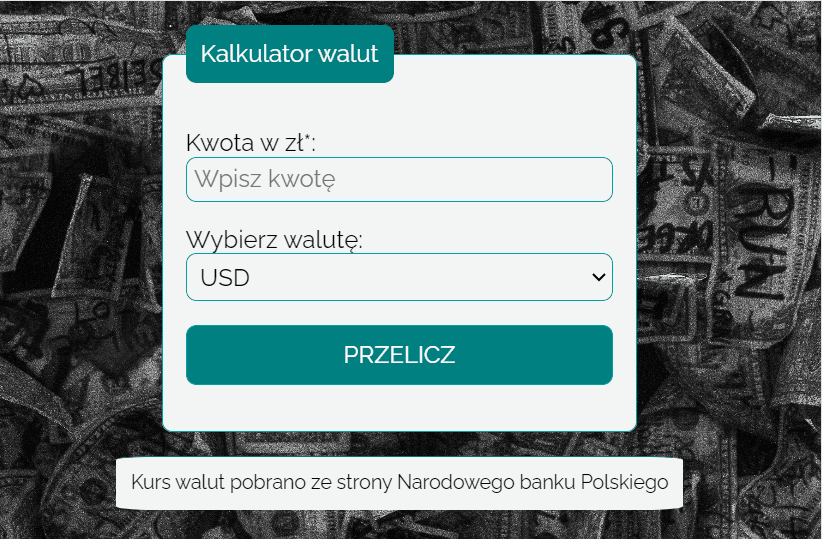

# Currency conventer

This repository present simple currency converter, that was created as a project based on the YouCode - Frontend Developer Course.

# Demo

[https://ulczik.github.io/Money-converter/](https://ulczik.github.io/Money-converter/)

## How to use

## Description

Here you can convert PLN to following currency:

- USD
- EUR 
- GBP

## Used languages / methods

-   _HTML5_
-   _CSS3_
-   _JavaScript with ES6+ features_
-   _BEM_.
